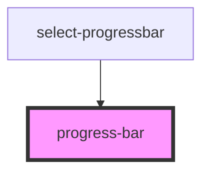

# progress-bar

<!-- Auto Generated Below -->

## Properties

| Property | Attribute | Description | Type     | Default           |
| -------- | --------- | ----------- | -------- | ----------------- |
| `type`   | `type`    |             | `string` | `'InDeterminate'` |

## Dependencies

### Used by

 - [select-progressbar](../select-progressbar)

### Graph

----------------------------------------------

*Built with [StencilJS](https://stenciljs.com/)*
